<div align="center">



# Nerve

**The cockpit ZeroClaw deserves.**

*ZeroClaw is powerful. Nerve is the interface that makes people say "oh, now I get it."*


[](https://github.com/epsilonode/nerve-zero)
[](LICENSE)
[](https://discord.gg/Sh9ZGtctva)

</div>

> **Fork notice:** This is `epsilonode/nerve-zero`, a fork of [`daggerhashimoto/openclaw-nerve`](https://github.com/daggerhashimoto/openclaw-nerve).
> Fork changes: runtime migrated from Node.js to Bun, backend updated from OpenClaw to ZeroClaw, and **Windows support added**.
> Full credit and thanks to [@daggerhashimoto](https://github.com/daggerhashimoto) and all contributors to the original project.

```bash
curl -fsSL https://raw.githubusercontent.com/epsilonode/nerve-zero/master/install.sh | bash
```
> *Run the installer, live in 60 seconds*


<div align="center">

<https://github.com/user-attachments/assets/25d65a85-1d42-45bc-baae-5e6fca531705>

</div>

<table align="center">
<p align="center">
<strong>Mobile Screenshots</strong>
  </p>
<tr>
<td align="center"></td>
<td align="center"></td>
<td align="center"></td>
</tr>
</table>

## Why Nerve exists

Chat is great for talking to agents.
It is not enough for operating them.

The moment you care about visibility, control and coordination over your agents, the thread gets too small. You want the workspace, sessions, taskboard, editor, usage, and agent context in one place.

*Nerve is that place.*

## Why it feels different

### ✨ Fleet control, not just chat
Run multiple agents from one place. Each agent can have its own workspace, subagents, memory, identity, soul, and skills, while Nerve gives you a single control plane to switch context, inspect state, and operate the whole fleet.

### ✨ Voice that feels built in
Push-to-talk, wake word flows, explicit language selection, local Whisper transcription, multilingual stop and cancel phrases, and multiple TTS providers. Voice is part of the product, not an afterthought.

### ✨ Full agent operating context
Each agent can have its own workspace, memory, identity, soul, and skills. Nerve lets you inspect, edit, and manage that context live, without guessing what an agent knows, where it works, or how it is configured.

### ✨ A real operating layer
Crons, session trees, kanban workflows, review loops, proposal inboxes, and model overrides. Nerve gives agent work an operating surface instead of leaving it trapped inside chat history.

### ✨ Rich live output
Charts, diffs, previews, syntax-highlighted code, structured tool rendering, and streaming UI that makes agent responses easier to inspect.

><details>
>
> <summary>What you can do with it</summary>
> 
> - **Talk to your agent by voice** and hear it answer back naturally
> - **Browse and edit the workspace live** while the conversation is still happening
> - **Watch cron runs as separate sessions** instead of treating automation like a black box
> - **Delegate work onto a kanban board** and review what came back
> - **Ask for a chart** and get a real chart, not a code block pretending to be one
> - **Track token usage, costs, and context pressure** while long tasks run
> - **Inspect subagent activity** without losing the main thread
> - **Switch between per-agent workspaces and memory** without losing context
> - **Inspect each agent’s identity, soul, and skills** from the UI
> - **Delegate subagent work inside a larger agent fleet** instead of treating everything as one thread

</details>

## Capability snapshot

| Area | Highlights |
|---|---|
| **Agent fleet** | Run multiple agents from one control plane, each with its own workspace, subagents, memory, identity, soul, and skills |
| **Interaction** | Streaming chat, markdown, syntax highlighting, diff views, image paste, file previews, voice input, TTS, live transcription preview |
| **Workspace** | Per-agent file browser, tabbed editor, memory editing, config editing, skills browser |
| **Operations** | Session tree, subagents, cron scheduling, kanban task board, review flow, proposal inbox, model overrides |
| **Observability** | Token usage, cost tracking, context meter, agent logs, event logs |
| **Polish** | Command palette, responsive UI, 14 themes, font family and 10px to 24px font size controls, mobile-safe input sizing, hot-reloadable settings, updater with rollback |
| **Platform** | macOS, Linux, and **Windows** (via Git Bash or native) |
## Get started

### One command

**macOS / Linux:**
```bash
curl -fsSL https://raw.githubusercontent.com/epsilonode/nerve-zero/master/install.sh | bash
```

**Windows (Git Bash):**
```bash
curl -fsSL https://raw.githubusercontent.com/epsilonode/nerve-zero/master/install.sh | bash
```
> *Requires [Git for Windows](https://git-scm.com/download/win) (which includes Git Bash) and [Bun](https://bun.sh).*

> *The installer handles dependencies, clone, build, and then usually hands off straight into the setup wizard. Guided access modes include localhost, LAN, Tailscale tailnet IP, and Tailscale Serve.*


### Pick your setup

- **[Local](https://github.com/daggerhashimoto/openclaw-nerve/blob/master/docs/DEPLOYMENT-A.md)** — Run Nerve and Gateway on one machine. *Recommended default setup for reliability and simplicity.*
- **[Hybrid](https://github.com/daggerhashimoto/openclaw-nerve/blob/master/docs/DEPLOYMENT-B.md)** — Keep Nerve local, run Gateway in the cloud
- **[Cloud](https://github.com/daggerhashimoto/openclaw-nerve/blob/master/docs/DEPLOYMENT-C.md)** — Run Nerve and Gateway in the cloud

<details><summary><strong>Manual install</strong></summary>

```bash
git clone https://github.com/epsilonode/nerve-zero.git
cd nerve-zero
bun install
bun run setup
bun start
```

</details>

<details><summary><strong>Windows (manual)</strong></summary>

Requires [Git for Windows](https://git-scm.com/download/win) and [Bun](https://bun.sh).

```powershell
git clone https://github.com/epsilonode/nerve-zero.git
cd nerve-zero
bun install
bun run setup
bun start
```

To run as a background service, use [NSSM](https://nssm.cc):
```powershell
nssm install nerve bun server-dist/index.js
nssm set nerve AppDirectory C:\path\to\nerve-zero
nssm start nerve
```

</details>


<details><summary><strong>Updating</strong></summary>


```bash
bun run update -- --yes
```

Fetches the latest release, rebuilds, restarts, verifies health, and rolls back automatically on failure.

</details>

<details><summary><strong>Development</strong></summary>

```bash
bun run dev # frontend — Vite on :3080 by default
PORT=3081 bun run dev:server # backend — explicit split-port dev setup
```

`bun run dev:server` uses the normal server `PORT` setting. If you do not override it, the backend also defaults to `:3080` and will collide with Vite.

`bun start` is the normal local boot path. If `dist/` is missing, it builds once and then starts the Bun server.

**Requires:** Bun 1.0+ and a ZeroClaw gateway.
</details>


## How it fits into ZeroClaw

Nerve sits in front of the gateway and gives you a richer operating surface in the browser.

```text
Browser ─── Nerve (:3080) ─── ZeroClaw Gateway (:18789)
 │           │
 ├─ WS ──────┤ proxied to gateway
 ├─ SSE ─────┤ file watchers, real-time sync
 └─ REST ────┘ files, memories, TTS, models
```

ZeroClaw remains the engine. Nerve gives it a cockpit.

**Frontend:** React 19 · Tailwind CSS 4 · shadcn/ui · Vite 7 
**Backend:** Hono 4 on Bun

## Security

Nerve binds to `127.0.0.1` by default, so it stays local unless you choose to expose it.

When you bind it to the network (`HOST=0.0.0.0`), built-in password authentication protects the UI and its endpoints. Sessions use signed cookies, passwords are stored as hashes, WebSocket upgrades are authenticated, and trusted connections can use server-side gateway token injection.

For the full threat model and hardening details, see **[docs/SECURITY.md](https://github.com/daggerhashimoto/openclaw-nerve/blob/master/docs/SECURITY.md)**.

## Documentation

Documentation is maintained by the upstream project. See the [openclaw-nerve docs](https://github.com/daggerhashimoto/openclaw-nerve/tree/master/docs) for full reference material including architecture, configuration, deployment guides, troubleshooting, and more.

## Community

If this is the kind of interface you want around your ZeroClaw setup, give the repo a star and keep an eye on it.

Join the **[Nerve Discord](https://discord.gg/Sh9ZGtctva)** to get help, discuss, share your setup, and follow development.

## License

[MIT](LICENSE)

This project is a fork of [daggerhashimoto/openclaw-nerve](https://github.com/daggerhashimoto/openclaw-nerve), used under the MIT License. Original work Copyright (c) daggerhashimoto and contributors.
